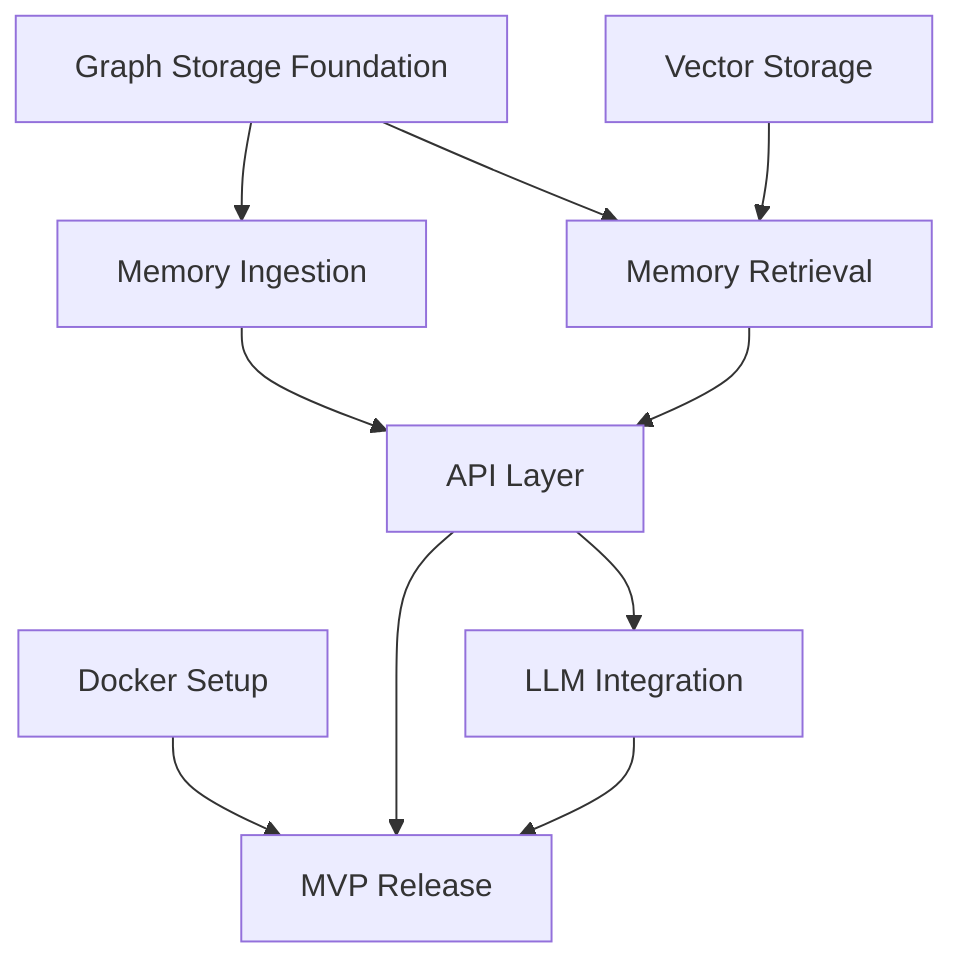
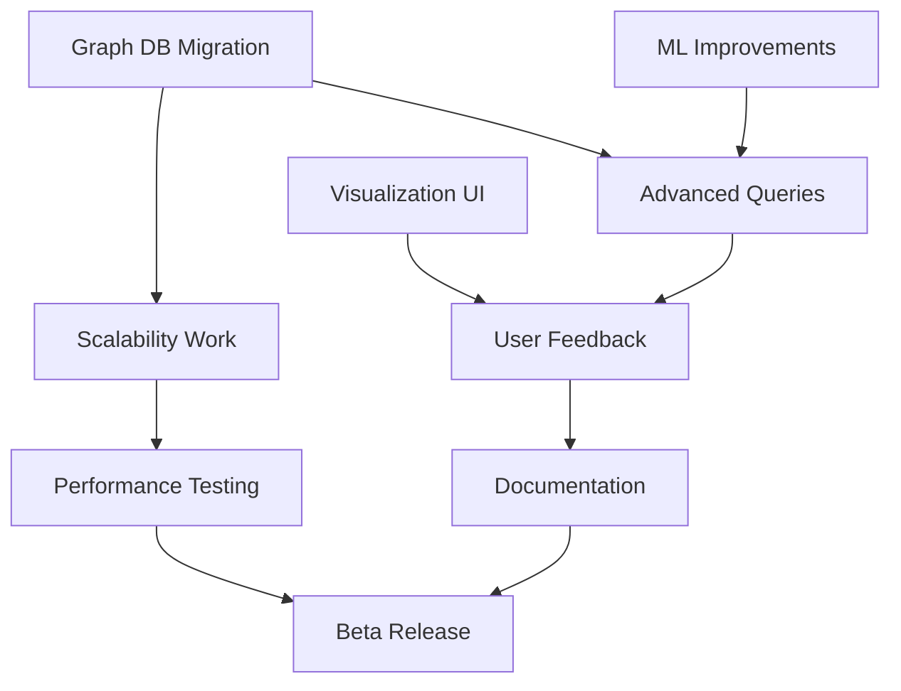
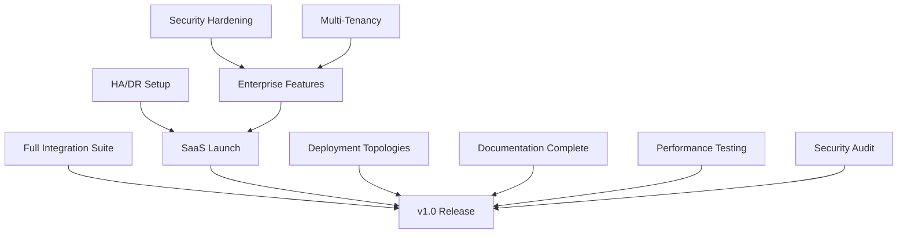

# LLM-Memory-Graph Phased Roadmap

## Executive Summary

This roadmap outlines the development journey from MVP to v1.0 for LLM-Memory-Graph, a graph-based memory management system for Large Language Model applications. The system enables persistent, queryable knowledge graphs that enhance LLM context and conversation continuity.

---

## PHASE 1: MVP (Minimum Viable Product)

**Timeline:** 8-12 weeks
**Team Size:** 2-3 engineers (1 backend, 1 full-stack, 0.5 DevOps)

### Core Features

#### 1.1 Graph Storage Foundation
- **In-memory graph data structure** (NetworkX or similar)
- **Basic node types:**
  - Message nodes (user/assistant turns)
  - Entity nodes (people, places, concepts)
  - Topic nodes (conversation themes)
- **Basic edge types:**
  - RELATES_TO (entity relationships)
  - FOLLOWS (conversation flow)
  - MENTIONS (entity references)
- **CRUD operations** for nodes and edges

#### 1.2 Memory Ingestion
- **Text parsing pipeline:**
  - Simple NER (Named Entity Recognition) using spaCy
  - Keyword extraction (TF-IDF)
  - Sentence embedding (sentence-transformers)
- **Conversation tracking:**
  - Session management
  - Turn-based node creation
  - Automatic entity linking

#### 1.3 Memory Retrieval
- **Basic query interface:**
  - Get conversation history by session
  - Find related entities
  - Retrieve context by similarity
- **Simple ranking:**
  - Recency weighting
  - Direct relationship scoring
  - Cosine similarity for semantic search

#### 1.4 API Layer
- **REST API (FastAPI/Flask):**
  - POST /memory/add - Add conversation turn
  - GET /memory/search - Query knowledge graph
  - GET /memory/context/:session - Get session context
  - GET /memory/entities - List all entities
  - DELETE /memory/session/:id - Clear session
- **OpenAPI specification**
- **Basic authentication** (API keys)

### Essential Integrations

#### 1.5 LLM Integration
- **OpenAI API connector:**
  - GPT-3.5/GPT-4 support
  - Context injection helpers
  - Response parsing
- **Anthropic Claude connector** (basic)
- **Generic provider interface** for extensibility

#### 1.6 Vector Storage
- **ChromaDB or FAISS integration:**
  - Store conversation embeddings
  - Hybrid search (graph + vector)
  - Embedding cache management

### Simple Deployment Mode

#### 1.7 Local Development Setup
- **Docker Compose configuration:**
  - API server container
  - In-memory graph (persistent volume)
  - Vector DB container
- **Environment-based configuration**
- **Health check endpoints**

#### 1.8 Basic Observability
- **Structured logging** (JSON format)
- **Prometheus metrics:**
  - Request count/latency
  - Graph size (nodes/edges)
  - Memory usage
- **Simple health dashboard**

### Success Metrics

| Metric | Target |
|--------|--------|
| **Functional** | |
| Graph operations latency (p95) | < 100ms |
| Context retrieval accuracy | > 70% (manual evaluation) |
| System uptime | > 95% |
| **Adoption** | |
| Developer onboarding time | < 2 hours |
| API response time (p95) | < 500ms |
| Documentation coverage | > 80% of core features |
| **Technical** | |
| Graph storage capacity | 10K nodes, 50K edges |
| Concurrent sessions supported | 50+ |
| Memory footprint | < 2GB for typical workload |

### Critical Path Dependencies



### Risk Mitigation

| Risk | Impact | Mitigation Strategy |
|------|--------|---------------------|
| Graph performance degradation | High | Implement caching, index optimization, benchmark early |
| Entity extraction accuracy | Medium | Start with conservative NER, allow manual corrections |
| Scope creep | High | Strict feature freeze, defer advanced queries to Beta |
| Third-party API rate limits | Medium | Implement rate limiting, caching, graceful degradation |

---

## PHASE 2: Beta Phase

**Timeline:** 10-14 weeks
**Team Size:** 4-5 engineers (2 backend, 1 frontend, 1 ML, 1 DevOps)

### Enhanced Features

#### 2.1 Advanced Graph Analytics
- **Community detection algorithms:**
  - Topic clustering (Louvain, Label Propagation)
  - Conversation thread analysis
  - Entity relationship mapping
- **Path finding:**
  - Shortest path between concepts
  - Contextual bridges (how topics connect)
  - Influence propagation tracking
- **Temporal analysis:**
  - Time-based graph evolution
  - Conversation arc visualization
  - Memory decay modeling

#### 2.2 Interactive Visualization
- **Web-based graph explorer:**
  - D3.js or Cytoscape.js rendering
  - Real-time graph updates (WebSocket)
  - Node/edge filtering and search
- **Visualization modes:**
  - Conversation timeline view
  - Entity relationship map
  - Topic cluster view
  - Heatmap for frequently accessed nodes
- **Export capabilities** (PNG, SVG, GraphML)

#### 2.3 Advanced Query Engine
- **Graph query language:**
  - Cypher-like syntax support (via Neo4j driver)
  - Complex pattern matching
  - Aggregation and analytics queries
- **Semantic search enhancements:**
  - Multi-hop reasoning
  - Analogical search (find similar patterns)
  - Contextual re-ranking using LLM
- **Saved queries and templates**

#### 2.4 Memory Management Strategies
- **Intelligent pruning:**
  - Importance scoring (PageRank variant)
  - Time-decay for relevance
  - User-defined retention policies
- **Memory consolidation:**
  - Duplicate entity merging
  - Conversation summarization nodes
  - Hierarchical topic abstraction
- **Versioning and rollback**

### Additional Integrations

#### 2.5 Multi-Provider LLM Support
- **Extended provider support:**
  - Google PaLM/Gemini
  - Cohere
  - Azure OpenAI
  - Hugging Face Inference API
- **Provider-agnostic abstraction layer**
- **Automatic fallback and retry logic**

#### 2.6 External Knowledge Sources
- **Wikipedia/Wikidata integration:**
  - Entity enrichment with external facts
  - Link extraction and validation
  - Knowledge graph augmentation
- **Custom knowledge base connectors:**
  - Document ingestion (PDF, Markdown)
  - Structured data import (CSV, JSON)
  - API-based knowledge retrieval

#### 2.7 Real-time Collaboration
- **Multi-user graph access:**
  - Conflict resolution (CRDT or OT)
  - User permission model (read/write/admin)
  - Activity logs and audit trails
- **Shared session management**
- **Collaborative annotations**

### Performance Optimization

#### 2.8 Scalability Improvements
- **Graph database migration:**
  - Neo4j or TigerGraph integration
  - Migration tooling from in-memory
  - Distributed graph partitioning
- **Query optimization:**
  - Query plan analysis
  - Materialized views for common patterns
  - Index tuning
- **Caching layer:**
  - Redis for hot paths
  - Query result caching
  - Embedding cache optimization

#### 2.9 Asynchronous Processing
- **Background job queue** (Celery/RQ):
  - Deferred entity extraction
  - Batch embedding generation
  - Graph analytics computation
- **Streaming ingestion** (Kafka/RabbitMQ)
- **Event-driven architecture**

### User Feedback Incorporation

#### 2.10 Beta Program
- **Invite 20-50 early adopters:**
  - Chatbot developers
  - AI product teams
  - Research institutions
- **Feedback channels:**
  - In-app feedback widget
  - Bi-weekly user interviews
  - Public GitHub issues/discussions
- **Metrics collection:**
  - Feature usage analytics
  - Error rate tracking
  - User satisfaction surveys (NPS)

#### 2.11 Documentation Expansion
- **Interactive tutorials:**
  - Getting started guide (< 15 min)
  - Advanced patterns cookbook
  - Video walkthroughs
- **API reference:**
  - Auto-generated from OpenAPI spec
  - Code examples in 3+ languages (Python, JS, Go)
  - Postman collection
- **Architecture deep-dive:**
  - System design document
  - Performance tuning guide
  - Security best practices

### Success Metrics

| Metric | Target |
|--------|--------|
| **Performance** | |
| Graph query latency (p95) | < 200ms for 100K nodes |
| Concurrent users supported | 500+ |
| Embedding search recall@10 | > 85% |
| **Quality** | |
| Entity extraction F1 score | > 0.80 |
| Context relevance (LLM-as-judge) | > 80% |
| User-reported bug rate | < 5 per week |
| **Adoption** | |
| Beta user retention (30-day) | > 60% |
| Feature adoption rate | > 40% try visualization |
| Community contributions | 10+ PRs from external devs |
| **Scalability** | |
| Graph capacity | 1M+ nodes, 5M+ edges |
| Ingestion throughput | 100+ messages/sec |
| Storage efficiency | < 1KB per conversation turn |

### Critical Path Dependencies



### Risk Mitigation

| Risk | Impact | Mitigation Strategy |
|------|--------|---------------------|
| Graph DB migration complexity | High | Phased migration, maintain dual-write period, rollback plan |
| Beta user churn | Medium | Proactive support, feature prioritization based on feedback |
| Performance regression | High | Continuous benchmarking, load testing in CI/CD |
| Third-party dependency vulnerabilities | Medium | Automated security scanning, dependency pinning |
| Over-engineering visualization | Medium | Start with basic views, iterate based on usage data |

---

## PHASE 3: v1.0 Release

**Timeline:** 12-16 weeks
**Team Size:** 6-8 engineers (3 backend, 1 frontend, 1 ML, 1 DevOps, 1 QA, 1 Tech Writer)

### Production-Ready Features

#### 3.1 Enterprise-Grade Reliability
- **High availability:**
  - Multi-region deployment support
  - Automated failover (leader election)
  - Zero-downtime upgrades (blue-green deployment)
- **Data durability:**
  - Automated backups (hourly incremental, daily full)
  - Point-in-time recovery (PITR)
  - Cross-region replication
- **Disaster recovery:**
  - RTO < 1 hour, RPO < 15 minutes
  - Tested DR runbooks
  - Chaos engineering validation

#### 3.2 Advanced Security
- **Authentication & Authorization:**
  - OAuth 2.0 / OIDC integration
  - Role-based access control (RBAC)
  - Fine-grained permissions (graph-level, node-level)
- **Encryption:**
  - TLS 1.3 for data in transit
  - AES-256 for data at rest
  - Key management (AWS KMS, HashiCorp Vault)
- **Compliance:**
  - GDPR-compliant data deletion
  - Audit logging (tamper-proof)
  - SOC 2 Type II preparation

#### 3.3 Multi-Tenancy
- **Tenant isolation:**
  - Database-per-tenant or schema-per-tenant
  - Resource quotas and rate limiting
  - Cost allocation tracking
- **Self-service onboarding:**
  - Signup flow with email verification
  - Automatic workspace provisioning
  - Billing integration (Stripe)

#### 3.4 Advanced Analytics & Insights
- **Automated insights:**
  - Trend detection (emerging topics)
  - Anomaly detection (conversation patterns)
  - Predictive analytics (next likely queries)
- **Business intelligence:**
  - Export to BI tools (Tableau, Looker)
  - Custom report builder
  - Usage dashboards (per-tenant)
- **A/B testing framework** for memory strategies

#### 3.5 Developer Experience
- **SDKs for major languages:**
  - Python (official, fully featured)
  - JavaScript/TypeScript
  - Go
  - Java
- **CLI tool:**
  - Graph exploration from terminal
  - Bulk import/export utilities
  - Deployment management commands
- **IDE plugins:**
  - VS Code extension (graph explorer)
  - IntelliJ plugin
  - Syntax highlighting for query language

### Full Integration Suite

#### 3.6 LLM Framework Integrations
- **Native integrations:**
  - LangChain (MemoryManager implementation)
  - LlamaIndex (GraphIndex adapter)
  - Semantic Kernel (Memory connector)
  - Haystack (DocumentStore implementation)
- **Custom framework adapter SDK**

#### 3.7 Platform Integrations
- **Chat platforms:**
  - Slack bot integration
  - Discord bot integration
  - Microsoft Teams integration
- **CRM systems:**
  - Salesforce connector
  - HubSpot connector
  - Customer.io for user tracking
- **Observability:**
  - Datadog integration
  - New Relic APM
  - Sentry error tracking
  - OpenTelemetry exporter

#### 3.8 Data Pipeline Integrations
- **ETL tools:**
  - Apache Airflow DAGs
  - dbt models for analytics
  - Fivetran/Airbyte connectors
- **Streaming:**
  - Kafka Connect plugin
  - AWS Kinesis consumer
  - Google Pub/Sub subscriber

### All Deployment Topologies

#### 3.9 Cloud-Native Deployment
- **Kubernetes (K8s) manifests:**
  - Helm charts for easy deployment
  - Horizontal Pod Autoscaling (HPA)
  - Pod Disruption Budgets (PDB)
- **Managed cloud offerings:**
  - AWS ECS/EKS deployment guide
  - Google Cloud Run / GKE
  - Azure AKS
- **Terraform modules** for infrastructure as code

#### 3.10 Self-Hosted / On-Premise
- **VM deployment:**
  - Ansible playbooks
  - Vagrant boxes for testing
  - Systemd service units
- **Bare-metal support:**
  - Installation scripts
  - OS compatibility (Ubuntu 22.04+, RHEL 8+)
  - Resource sizing guidelines
- **Air-gapped deployment:**
  - Offline installation packages
  - Internal package mirroring guide

#### 3.11 Edge / Embedded Deployment
- **Lightweight mode:**
  - SQLite-backed graph storage
  - Reduced memory footprint (< 100MB)
  - Single-binary distribution (Go rewrite)
- **Mobile SDK (experimental):**
  - iOS framework
  - Android library
  - Cross-platform (React Native module)

#### 3.12 Managed SaaS Offering
- **Cloud-hosted service:**
  - Free tier (10K nodes, 1 project)
  - Pro tier ($49/month, 100K nodes, 5 projects)
  - Enterprise tier (custom pricing, unlimited)
- **Operational excellence:**
  - 99.9% SLA
  - 24/7 on-call support rotation
  - Automated monitoring and alerting
- **Customer portal:**
  - Usage analytics dashboard
  - Billing and subscription management
  - API key management

### Comprehensive Documentation

#### 3.13 User Documentation
- **Guides:**
  - Quickstart (5 min to first query)
  - Tutorials (10+ scenario-based)
  - Best practices guide
  - Migration guides (from competitors)
- **Video content:**
  - YouTube channel (tutorials, demos)
  - Weekly office hours recordings
  - Conference talk recordings
- **Community:**
  - Discord server (1000+ members)
  - Monthly newsletter
  - Annual conference (virtual)

#### 3.14 API & Developer Docs
- **Reference documentation:**
  - Auto-generated API docs (Swagger UI)
  - GraphQL schema documentation
  - Query language specification (EBNF)
- **Code examples:**
  - GitHub repo with 50+ examples
  - Use-case specific templates
  - Jupyter notebooks for data science workflows

#### 3.15 Operational Documentation
- **Admin guide:**
  - Deployment architectures
  - Performance tuning checklist
  - Security hardening guide
  - Backup and recovery procedures
- **Troubleshooting:**
  - Common issues and solutions (FAQ)
  - Debug mode and logging guide
  - Performance profiling tools
- **Contribution guide:**
  - Development setup (< 30 min)
  - Code style and conventions
  - PR review process

### Success Metrics

| Metric | Target |
|--------|--------|
| **Reliability** | |
| System uptime (SLA) | 99.9% (43 min downtime/month) |
| MTTR (Mean Time To Recovery) | < 15 minutes |
| Data loss incidents | Zero |
| **Performance** | |
| Graph query latency (p99) | < 500ms for 10M nodes |
| Concurrent users | 10,000+ |
| Ingestion throughput | 1000+ messages/sec |
| **Quality** | |
| Entity extraction F1 | > 0.85 |
| Zero-day security vulnerabilities | Zero |
| Test coverage | > 90% |
| **Adoption** | |
| Production deployments | 100+ organizations |
| GitHub stars | 5,000+ |
| NPM/PyPI downloads | 50K+/month |
| Community contributors | 50+ (all-time) |
| **Business** | |
| Free-to-paid conversion | > 5% |
| Monthly recurring revenue (MRR) | $50K+ |
| Customer satisfaction (CSAT) | > 4.5/5 |
| Customer retention (annual) | > 80% |

### Critical Path Dependencies



### Risk Mitigation

| Risk | Impact | Mitigation Strategy |
|------|--------|---------------------|
| SaaS launch delays | High | Soft launch with limited users, gradual rollout, feature flags |
| Security breach | Critical | Penetration testing, bug bounty program, security training |
| Scalability bottlenecks | High | Load testing at 3x expected capacity, capacity planning automation |
| Documentation debt | Medium | Dedicated tech writer, docs-as-code, community contributions |
| Competitive pressure | High | Focus on unique value (graph + LLM synergy), fast iteration cycles |
| Open-source sustainability | Medium | Dual licensing (Apache 2.0 + commercial), GitHub Sponsors, foundation membership |

---

## Cross-Cutting Concerns

### Technology Stack Evolution

| Component | MVP | Beta | v1.0 |
|-----------|-----|------|------|
| **Graph Storage** | NetworkX (in-memory) | Neo4j Community | Neo4j Enterprise / TigerGraph |
| **Vector DB** | FAISS / ChromaDB | Weaviate / Qdrant | Pinecone / Milvus |
| **API Framework** | FastAPI | FastAPI + GraphQL | FastAPI + GraphQL + gRPC |
| **Frontend** | None | React + D3.js | Next.js + React + D3.js |
| **Message Queue** | None | Redis Streams | Kafka / RabbitMQ |
| **Observability** | Logging + Prometheus | + Grafana | + Datadog / New Relic |
| **Infrastructure** | Docker Compose | K8s (dev) | K8s (prod) + Terraform |

### Team Growth & Resource Planning

| Phase | Headcount | Key Hires | Budget Estimate |
|-------|-----------|-----------|-----------------|
| **MVP** | 2-3 | Senior Backend Engineer, Full-Stack Engineer | $300K-$450K (salaries + infra) |
| **Beta** | 4-5 | ML Engineer, DevOps Engineer | $600K-$800K |
| **v1.0** | 6-8 | QA Engineer, Technical Writer, Frontend Specialist | $1M-$1.3M |

### Phased Budget Allocation

| Category | MVP % | Beta % | v1.0 % |
|----------|-------|--------|--------|
| Engineering | 70% | 65% | 60% |
| Infrastructure | 15% | 20% | 25% |
| Marketing/Community | 5% | 10% | 10% |
| Operations/Support | 10% | 5% | 5% |

### Timeline Summary

```
MVP: Weeks 1-12
├─ Weeks 1-4: Core graph engine & ingestion
├─ Weeks 5-8: Retrieval, API layer, LLM integration
├─ Weeks 9-11: Testing, documentation, Docker setup
└─ Week 12: MVP launch

Beta: Weeks 13-26
├─ Weeks 13-16: Graph analytics, visualization
├─ Weeks 17-20: Advanced queries, performance optimization
├─ Weeks 21-24: Additional integrations, beta program
└─ Weeks 25-26: Beta release

v1.0: Weeks 27-42
├─ Weeks 27-32: Security, multi-tenancy, HA/DR
├─ Weeks 33-37: Full integrations, all deployment modes
├─ Weeks 38-40: SaaS platform, documentation
├─ Weeks 41-42: Security audit, load testing
└─ Week 43: v1.0 General Availability
```

**Total Time to v1.0:** 10-11 months

---

## Success Criteria & Exit Gates

### MVP → Beta Gate
- [ ] All core features implemented and tested
- [ ] At least 5 external developers successfully onboard
- [ ] API latency < 500ms p95 for basic queries
- [ ] Documentation covers 100% of API endpoints
- [ ] Zero critical security vulnerabilities
- [ ] Product demo completed to 3+ potential users with positive feedback

### Beta → v1.0 Gate
- [ ] 20+ beta users in production
- [ ] Scalability tested to 1M nodes, 500 concurrent users
- [ ] Security audit completed with all high/critical issues resolved
- [ ] Complete documentation (user + dev + ops)
- [ ] 3+ deployment topologies validated in production-like environments
- [ ] Customer satisfaction > 4.0/5.0
- [ ] Business model validated (10+ paying customers or clear path to revenue)
- [ ] Support runbooks and on-call process established

---

## Appendix: Alternative Paths

### Fast Track to Market (6 months to Beta)
- **Tradeoffs:**
  - Skip advanced analytics in Beta
  - Launch with 1-2 LLM providers only
  - Use managed Neo4j instead of building scalability layer
- **When to choose:** Competitive pressure, early customer commitments

### Research-First Approach (18 months to v1.0)
- **Additions:**
  - Novel graph neural network for entity extraction
  - Published research on memory consolidation algorithms
  - Academic collaborations
- **When to choose:** Grant funding, academic spin-out, IP differentiation strategy

### Open-Core Model
- **v1.0 features split:**
  - Open source: Core engine, basic integrations, self-hosted only
  - Commercial: Multi-tenancy, SaaS, advanced analytics, enterprise integrations
- **When to choose:** Community-building priority, VC-backed growth

---

## Conclusion

This roadmap provides a structured path from MVP to production-ready v1.0, with clear milestones, success metrics, and risk mitigation strategies. The phased approach allows for iterative learning and course correction while maintaining focus on delivering value at each stage.

**Key Success Factors:**
1. **Ruthless prioritization** - Resist feature creep, especially in MVP
2. **User feedback loops** - Engage early adopters continuously
3. **Technical excellence** - Don't compromise on performance and security fundamentals
4. **Documentation culture** - Treat docs as first-class deliverables
5. **Operational readiness** - Build reliability in from day one, not as afterthought

**Next Steps:**
1. Validate roadmap with stakeholders (technical + business)
2. Define OKRs (Objectives & Key Results) for each quarter
3. Set up project management framework (JIRA/Linear)
4. Begin hiring for MVP team
5. Establish developer community channels (GitHub, Discord)
6. Create technical architecture document aligned with MVP scope
